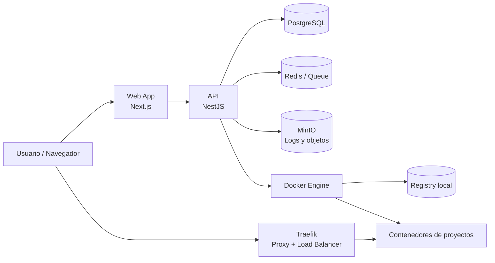
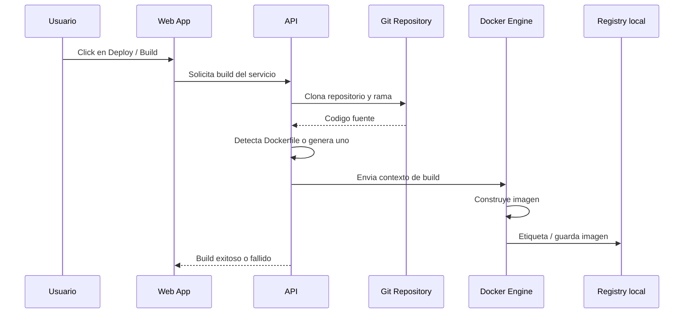
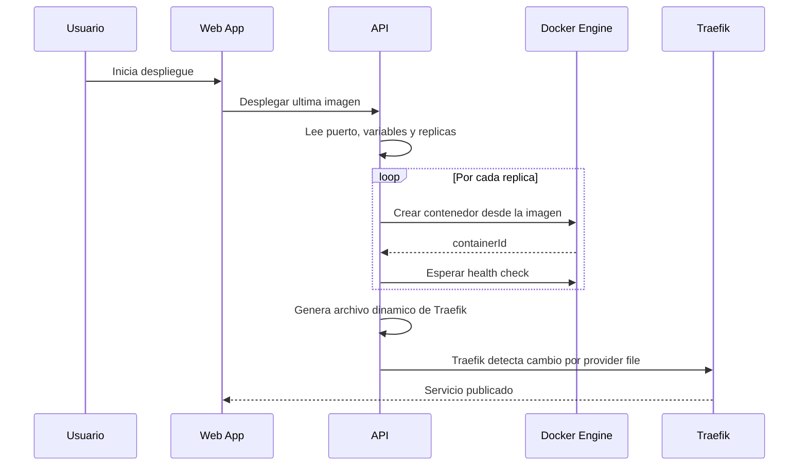
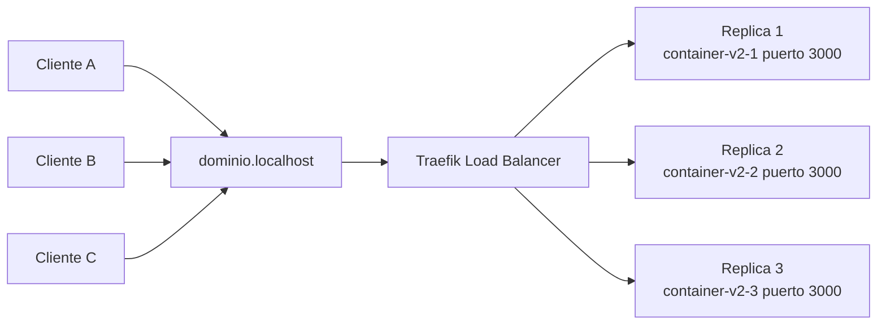
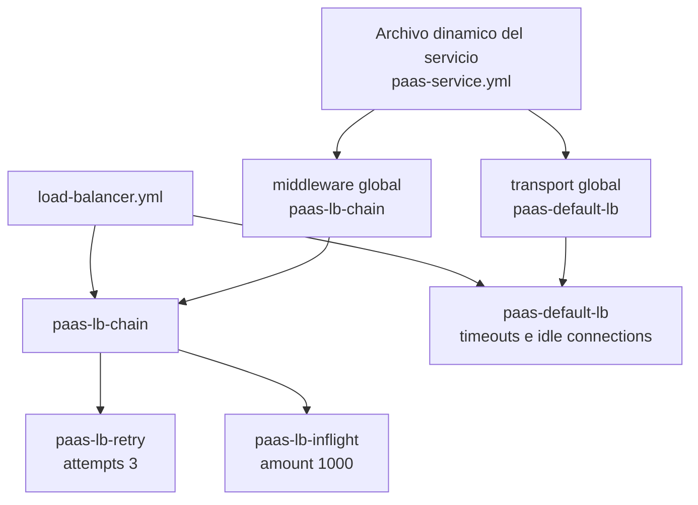
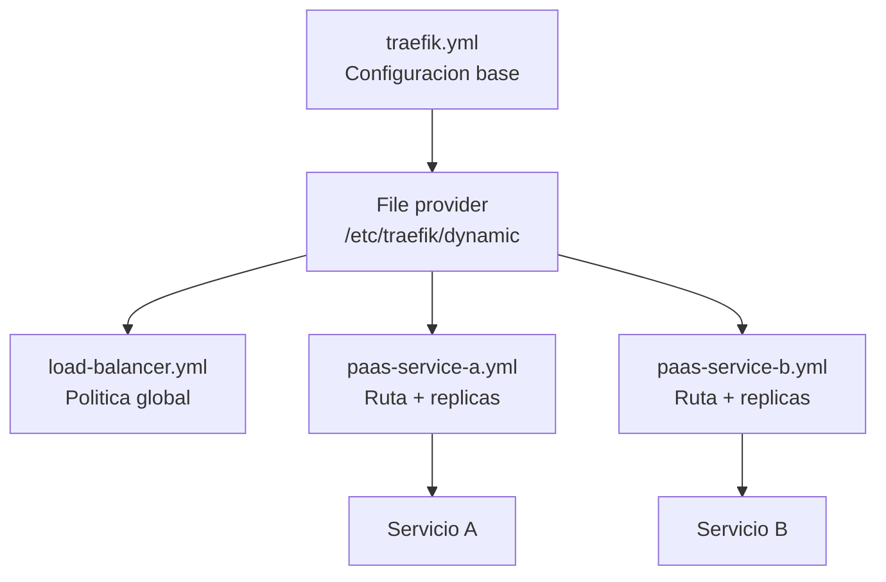
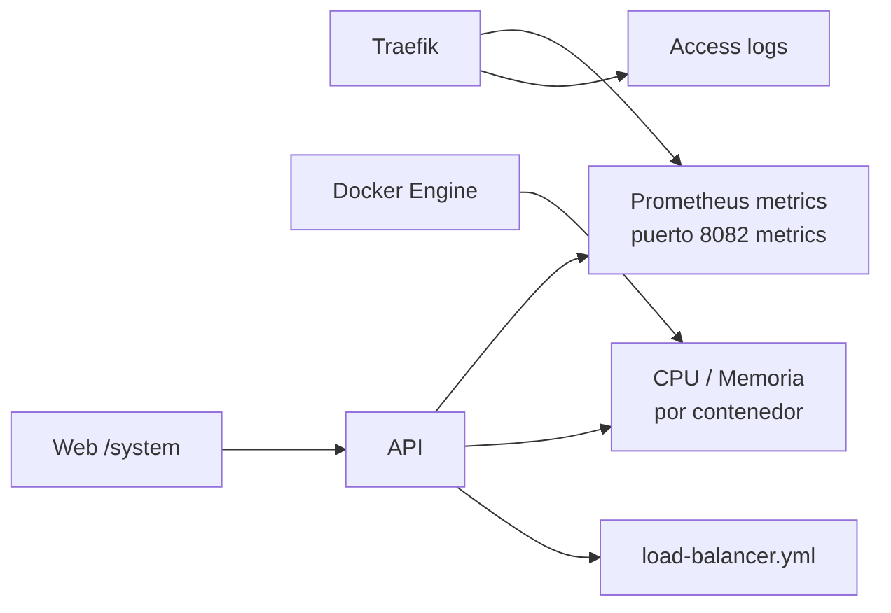
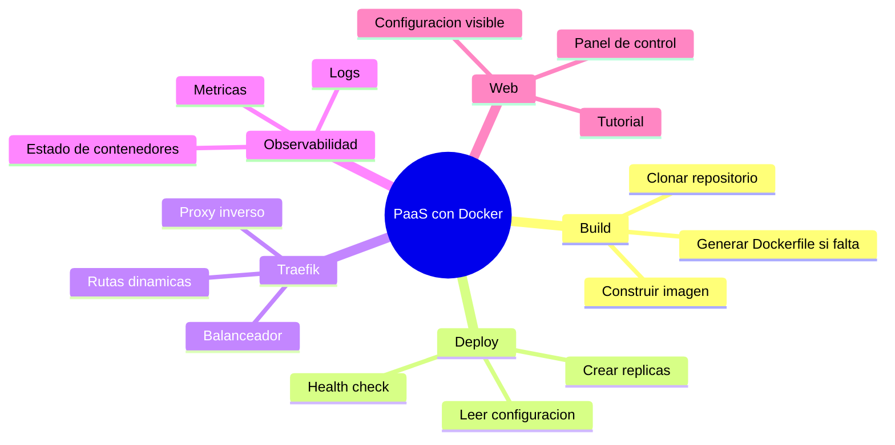
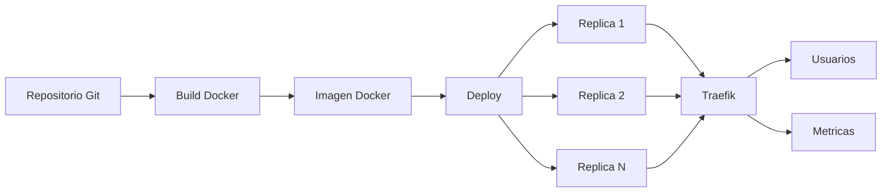

# Diagramas de Funcionamiento

Estos diagramas explican como se conectan Docker, la API, Traefik, las replicas y las metricas dentro de la plataforma.

Version en ingles: [DIAGRAMS.en.md](./DIAGRAMS.en.md)

## 1. Arquitectura General

La web administra la plataforma. La API orquesta builds y despliegues. Docker ejecuta la plataforma y los proyectos. Traefik recibe el trafico externo y lo dirige al servicio correcto.

## 2. Flujo de Build

La API no ejecuta el codigo directamente. Primero crea una imagen Docker reproducible. Esa imagen sera la base del despliegue.

## 3. Flujo de Deploy con Replicas

Si el servicio tiene `replicas = 2`, la API crea dos contenedores con la misma imagen y luego Traefik los registra como servidores del mismo servicio.

## 4. Balanceador de Cargas

El usuario solo conoce el dominio. Traefik conoce las replicas internas y reparte las peticiones entre ellas.

## 5. Configuracion Global del Balanceador

La configuracion global evita repetir politicas en cada servicio. Cada ruta generada referencia `paas-lb-chain@file` y `paas-default-lb@file`.

## 6. Archivos de Traefik

`traefik.yml` dice donde buscar configuracion dinamica. Los archivos `paas-*.yml` son generados por la API durante el despliegue.

## 7. Observabilidad

La pantalla `/system` consulta la API. La API lee Docker, Traefik y el archivo global del balanceador para mostrar el estado real.

## 8. Mapa Mental para Exponer

## 9. Resumen Visual

La idea central: un repositorio se convierte en una imagen; una imagen se convierte en varias replicas; Traefik publica el dominio y reparte el trafico.
