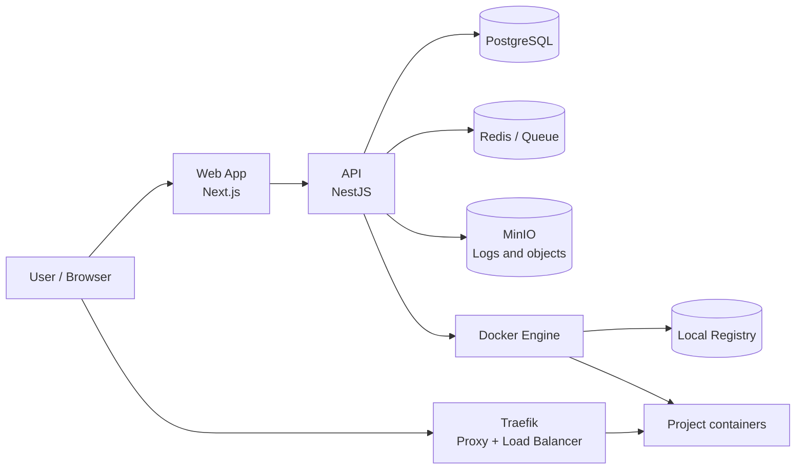
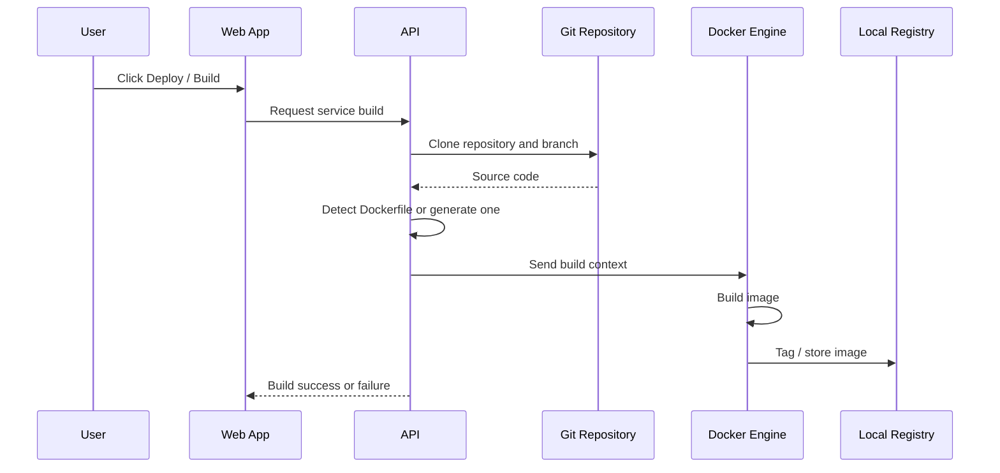
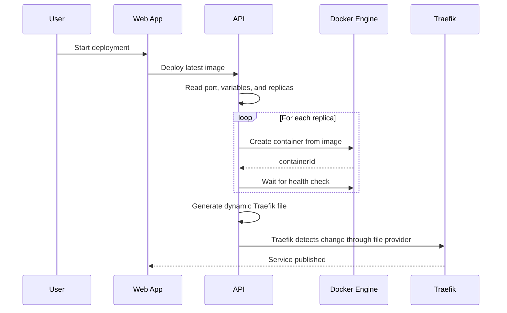
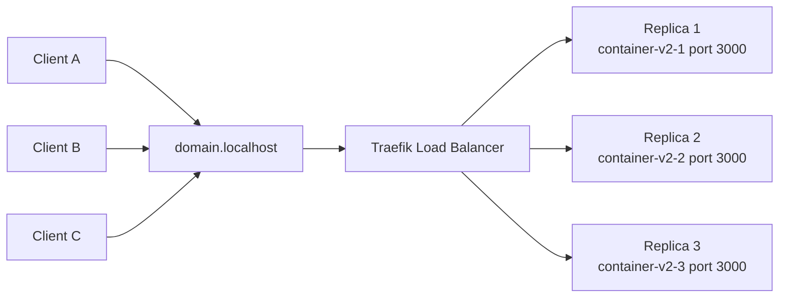
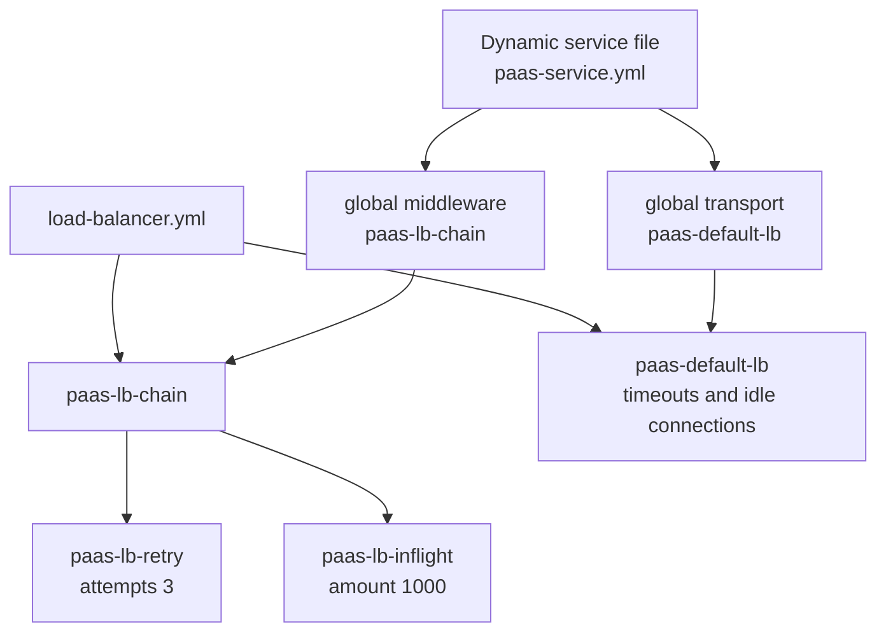
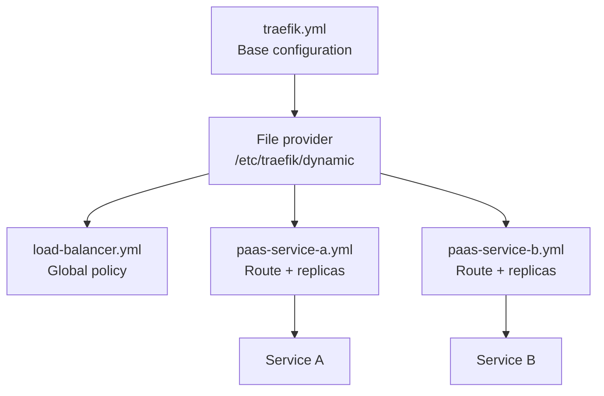
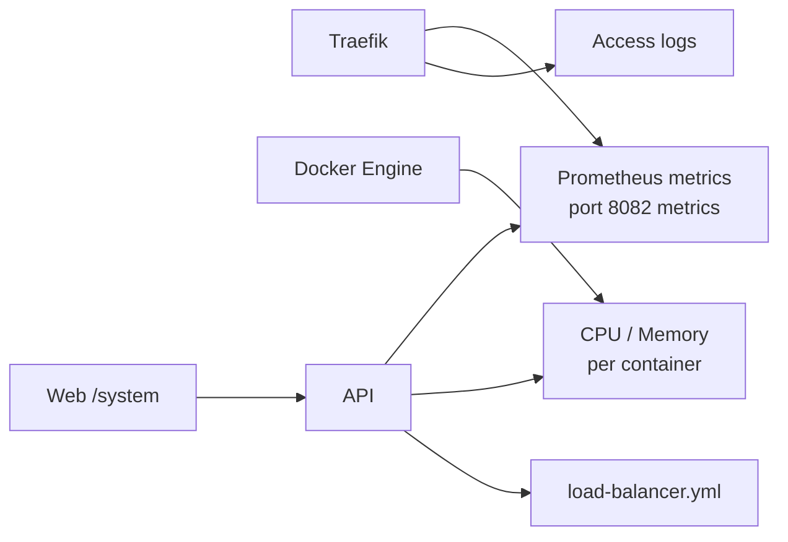
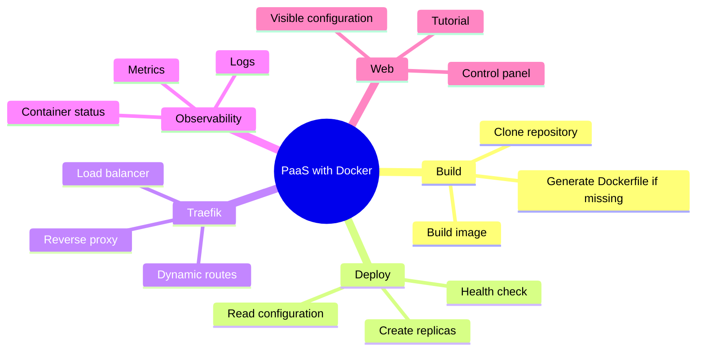
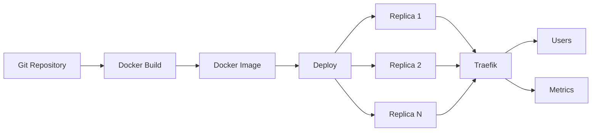

# System Diagrams

These diagrams explain how Docker, the API, Traefik, replicas, and metrics are connected inside the platform.

Spanish version: [DIAGRAMAS.md](./DIAGRAMAS.md)

## 1. General Architecture

The web app manages the platform. The API orchestrates builds and deployments. Docker runs the platform and user projects. Traefik receives external traffic and routes it to the correct service.

## 2. Build Flow

The API does not run the code directly. It first creates a reproducible Docker image. That image becomes the base of the deployment.

## 3. Deploy Flow With Replicas

If the service has `replicas = 2`, the API creates two containers with the same image and then Traefik registers them as servers for the same service.

## 4. Load Balancer

The user only knows the domain. Traefik knows the internal replicas and distributes requests across them.

## 5. Global Load Balancer Configuration

The global configuration avoids repeating policies in every service. Each generated route references `paas-lb-chain@file` and `paas-default-lb@file`.

## 6. Traefik Files

`traefik.yml` tells Traefik where to find dynamic configuration. The `paas-*.yml` files are generated by the API during deployment.

## 7. Observability

The `/system` screen queries the API. The API reads Docker, Traefik, and the global load balancer file to show the real state.

## 8. Presentation Mind Map

## 9. Visual Summary

Core idea: a repository becomes an image; an image becomes multiple replicas; Traefik publishes the domain and distributes traffic.
